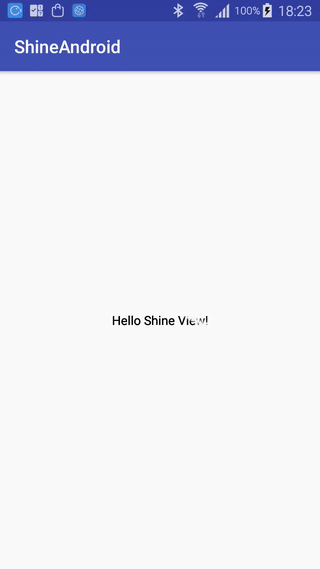

# ShineAndroid
一个用于Android的带闪光效果的布局容器,放入该容器内的视图可以开启或关闭闪光效果

# 支持的5种闪光角度

```
public enum MaskAngle {
        CW_0, // left top to right bottom
        CW_90, // top to bottom
        CW_180, // bottom right to top left
        CW_210,// top right to bottom left
        CW_270, // bottom to top
}
```

# 效果图

